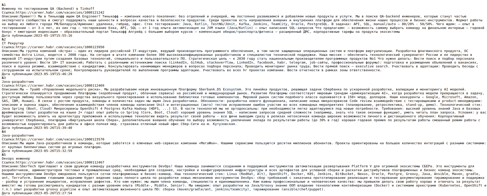
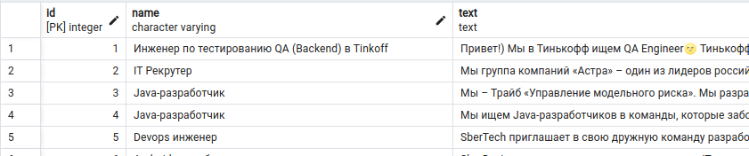

# Проект - Агрегатор вакансий

## О проекте

Программа представляет собой парсер вакансий с сайта https://career.habr.com/vacancies/.
Преобразованные страницы сохраняются в БД PostgreSQL.

## Использованные технологии 
* JDBC
* PostgreSQL
* Quartz
* Socket

## Требования к окружению 

* PostgreSQL 15 
* Maven
* JDK 17

## Запуск проекта 
1. Установить JDK 17
2. Установить Maven
3. Установить сервер БД PostgreSQL. 
При установке задать: имя пользователя - postgres, пароль - postgres, порт - 5432
4. Создать БД с именем schema
5. Выполнить скрипт для создания таблицы:
```
create table post(
	id serial primary key,
	name varchar(250),
	text text,
	link text UNIQUE,
	created timestamp
);
```
6. Скачать проект с GitHub 
7. Перейти в корень проекта и начать сборку с помощью команды 
```shell
mvn package
```
8. Перейти в папку target и запустить приложение с помощью команды
```shell
java -jar job4j_grabber-1.0-SNAPSHOT.jar 
```
## Взаимодействие с приложением 
После запуска программы перейти http://localhost:9000/

Как мы видим, данные записались в БД (для удобства в программе PgAdmin)


## Контакты
vithag97@mail.ru